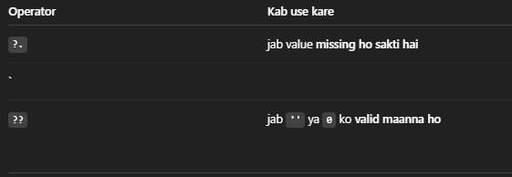
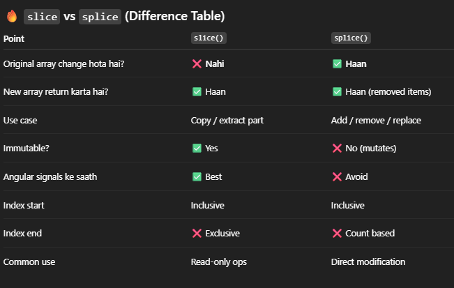

Null safe Navigation:
    ?.  -> this says agar ye cheez exist karti hai tab hi age jao, otherwise error mat throw karo
        -> so, agar angular me bina ?. ke agar value undefine hui then app crash ho sakta hai.
        -> it is a kind or error prevention jaise man lo user undefined hai but hum use call kar 
           dete hai then error throw hoga but ?. use karne ke baad error throw hoga but app crash nhi hoga.

Very Important Image 
========================================================================================

Falsy:
    JavaScript me if (...) ke andar agar values ko false man li jati hai chahe vo actual me fasle ho ya na ho.

    Ye sab falsy hai: 
        false
        0
        -0
        ""        // empty string
        null
        undefined
        NaN
    
    -> jab empty string/ 0/ false ko invalid manna ho then we use ||. 

========================================================================================

 Structural Directives -> Micro syntax
    -> * is a shorthand that expands to an underlying <ng-templeate>
    -> it provides context variables like; index as i, else
    -> Angular rewrites *ngIf and *ngFor etc using this syntax.

    So, when we write: 
OK

    then, internally, Angular rewrites it to:
        <ng-template [ngIf]="Ok">
            
OK

        </ng-template>

    here, * this is called as syntactic sugar which is a short term for <ng-template>

    -> ngIf:  condition ke basis par kisi HTML element ko dikhaya ya chupaya jata hai.
              if condition is true then element DOM me ata hai otherwise remove hojata h.
    -> ngFor: loops lagane ke lie use hota hai, so array me har item ke lie HTML repeat     
              karta hai.

    ngFor example:
        <ul>
            <li *ngFor="List of names is printing below: ">
                {{name}}
            </li>
        </ul>

        and names = ["vishal","rahul","naman"];

        then outptut will be:
        vishal
        rahul
        naman

========================================================================================

ngTemplateOutlet is an HTML buleprint: ye browser me tabhi render hota hai jab koi ise call karta hai
    <ng-template>: it defines a reusable template block(not rendered until referenced).
    [ngTemplateOutlet]: it chooses which template to render
    [ngTemplateOutletContext]: it passes values to the template. the $implicit key is read by a matching 
                                let variable.
    let-text: it declatres a local variable inside the template that reads the $implicit value form context.
    <ng-container>: it is a local wrapper that does not create extra DOM elements.

    alertType === 'info' ? infoTpl : alertType === 'warning' ? warnTpl : successTpl
    
    This is same as:

    if (alertType === 'info') {
        return infoTpl;
    } else if (alertType === 'warning') {
        return warnTpl;
    } else {
        return successTpl;
    }

========================================================================================

Template statements are the small pieces of code that runs when an event happens in the UI.
They are written inside the event bindings like:
    (click)="..."
    (input)="..."
    (change)="..."
they execute in the component's context and not global JS

Example:
    <button (click)="count = count + 1">Add</button>
    so, on click of this particular button the count variable will be incremented by 1 and
    it runs everytime the button is clicked.

$event:
    so this is a native DOM event object that angular passes to you.
    Example:
        <input (input)="onInput($event)" />
        $event = InputEvent
        $event.target = HTMLInputElement

========================================================================================

Now we gonna learn $implicit;
so it is a default value which you send to template without giving its name.

<ng-container
  [ngTemplateOutlet]="infoTpl"
  [ngTemplateOutletContext]="{ msg: message }"> // context object me key: msg
</ng-container>

<ng-template #infoTpl let-text="msg"> // this is template
  
{{ text }}

</ng-template>

=========== now this is implicit case ===========
<ng-container
  [ngTemplateOutlet]="infoTpl"
  [ngTemplateOutletContext]="{ $implicit: message }"> //context object me key is $implicit
</ng-container>

<ng-template #infoTpl let-text>  // this is template
  
{{ text }}

</ng-template>

========================================================================================

as alias with ngIf ka matlab hota hai isko ek short naam de do 
like: Angular me *ngIf="user as u"
iska meaning hai:
    agar user truthy hai toh us user ko ek local variable u me store karlo.

========================================================================================

pipes in templates transform values to display using the | operator
multiple pipes can be chained and pure pipes are used for better performance.

========================================================================================

Attribute binding in angular is used to set HTML attributes directly
    -> we have to use attribute binding when no corresponding DOM property exists.
    -> we use property binding for normal element properties and common with ARIA atttributes and 
        table attr like colspan.
    -> [attr.attributeName]="expression" so angular evaluates this expression and assignes its values
        to the HTML attribute.
    -> [attr.aria-label]: it sets HTML aria-label attribute using the component value.
    -> attr.: prefer attr. when no one is matching DOM property e.g. ARIA, colspan.
    -> for normal elements we have to use property binding and attr.
    -> get label(): Components a descriptive string from the current wide value.

========================================================================================

TrackBy:
    -> Angular jab *ngFor chalata hai, wo list ko compare karta hai.
    -> without trackBy DOM will recreate new objects. so using trackBy will prevent it from 
        recreating new objects.
    -> trackBy is a function that returns a unique identity for every function.
        e.g. id, uuid and database primary keys.
    -> *ngFor ... trackBy: trackById: Uses trackById to give each item a stable identity so
        Angular can reuse DOM nodes when the list order changes.
    -> trackById(index, item): Returns the unique key for an item. Here, it returns item.id regardless of index.

========================================================================================

parent to child communication is done by @Input and child to parent communication is done by @Output

========================================================================================

Content Projection:
    -> it renders parent provided content inside a child component.
    -> it marks insertion points using <ng-content>
    -> also it uses select to target specific slots.
    -> Eg. let's say dabba jiska design fixed hai vo child component, andar ka saman is parent ka HTML 
       and ng-content is dabbe ke andar ki jgah.

========================================================================================

LifeCycle Hooks 
    -> 

========================================================================================

Angular data Binding: 
    -> {{value}} -> this is interpolation so it is used to display the objects it is only for
        read only bindings.
    -> [prop]="value" HTML element ki property ko TS value deta hai.
    -> (event)=handler($event) -> ye HTML event ko TS method se connect karta hai. so it handles user actions.
    -> [(ngModel)]="value" -> TS ↔ HTML dono side data sync hota hia.
        -> Agar input box me user kuch type kare → value TypeScript variable me update ho jaati hai
        -> Agar TypeScript me variable change ho → UI automatically update ho jaata hai

========================================================================================

Angular Directives:
    -> It adds behaviour to elements with @Directive and a selector.
    -> it tells angular ki kisi existing element ya component ke sath kya extra behaviour add
        karna hai.
    -> Three types:
            -> Component Directives  -- Internally component is also a directive
            -> Structural Directives
            -> Attribute Directives
    -> Structural Directives includes *ngIf, *ngFor, and *ngSwitch
        e.g. 
Welcome
   so if isLoggenIn is true then ye welcome render 
            hoga otherwise ye gayab rahega. 
    -> Attribute directive main work is ki element ka naya look ya behaviour change karna bina 
        DOM remove kie.

========================================================================================

Angular Events:
    -> click events, type events, hover events, key press and mouse move these are some of the mouse events.
    -> there are keyup events that got triggered when we leave the keys.
        <input (keyup)="lastKey =$any($event).key>
        $event.key batata hai ki kaun si key press ki hai
            <input (keyup.enter)="submit()">  // enter dabaya then we submit
            <input (keyup.escape)="cancel()">  // esc dabaya then we cancel
Event Filtering:
    -> to run specific events/ functions when we press assigned keys like enter/ esc/ shift.
    -> we use debounced input to prevent repetitive calling of function, we call the functions only after the set 
        debouncing timer.

========================================================================================

Angular Conditionals:
    -> we use @if , @else if and @else for conditional logic whereas we use @switch to select 
       one view among many.
    -> Signals: drive the conditions from signals and read them with sig() in templates.
    -> @if removes objects from the DOM whereas [hidden] or css hides without destroying the object.
    

========================================================================================

Angular Lists:
    -> While rendering, it repeats the array/list data.
    -> so, we use @for to make the code more cleaner, faster and perfect with signals.
    -> 

    const copy = arr // isme new array nhi banti hai same reference use hota hai 
    const copy = [...arr] // isme new array banegi aur arr ke sare elements ko copy kia jayega.

    Math.random always gives random number between 0 and 1 (not inclusive so doesn't gives 1) 
    Sorting in TypeScript:
        .sort((x, y) => x.id - y.id) for ascending order and .sort((x, y) => y.id - x.id) for descending order sorting
            so,  Condition	      Result	        Effect
                    < 0	      x pehle aayega	   ASC order
                    > 0       y pehle aayega	
                    = 0	        order same	

========================================================================================

========================================================================================

